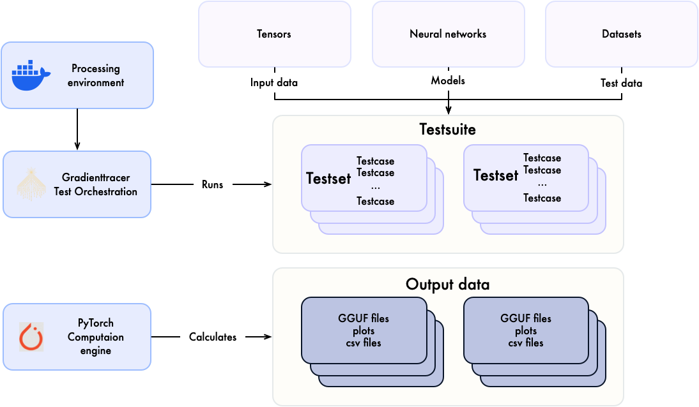

# SKaiNET Ground Truth


**SKaiNET Ground Truth** project provides a structured, scripted dataset compliant with the specifications defined by the **[gradienttracer](https://github.com/sk-ai-net/gradienttracer)** test framework, serving as the authoritative reference for validating [SKaiNET](https://skainet.sk) library calculations.


## Getting Started

### 1. Clone the Project

To get started with the [SKaiNET](https://skainet.sk) Ground Truth project, first clone the repository locally:

```bash
git clone https://github.com/sk-ai-net/skainet-ground-truth.git
cd skainet-ground-truth
```

### 2. Setup Development Environment

Navigate to the `pytorch` directory and follow the setup instructions:

```bash
cd pytorch
```

Then follow either the **Local Python Setup** or **Docker Setup** instructions detailed in the [`pytorch/README.md`](pytorch/README.md) file:

- **Local Python Setup**: Uses `uv` for Python package management and virtual environments
- **Docker Setup**: Uses containerized environment for isolated execution

Refer to the [`pytorch/README.md`](pytorch/README.md) for complete setup instructions and dependencies.

## Introduction

This project is designed to generate structured ground truth data for validating calculations used in the [SKaiNET](https://skainet.sk) machine learning framework. It leverages PyTorch for execution as an ultimative source of truth (we consider results of calculation executed by pytorch as valid) and utilizes the *[gradienttracer](https://github.com/sk-ai-net/gradienttracer) testing framework* for structuring, executing and storing the data in GGUF format.


## Note on Artifactss

Since the generated artifacts are binary files, they are not included in this repository. Instead, they are created during the execution of the test suites and stored in the `results` directory.
