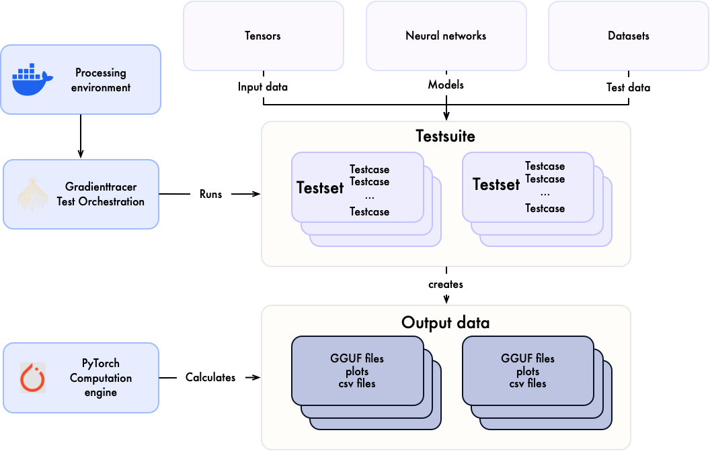

# SKaiNET Ground Truth

**SKaiNET Ground Truth** project provides a structured, scripted dataset compliant with the specifications defined by the **gradienttracer** test framework, serving as the authoritative reference for validating SKaiNET library calculations.

## Introduction

This project is designed to generate structured ground truth data for validating calculations used in the SKaiNET machine learning framework. It leverages PyTorch for execution as an ultimative source of truth (we consider results of calculation executed by pytorch as valid) and utilizes the *gradienttracer testing framework* for structuring, executing and storing the data in GGUF format. 

## Note on Artifactss

Since the generated artifacts are binary files, they are not included in this repository. Instead, they are created during the execution of the test suites and stored in the `results` directory.
